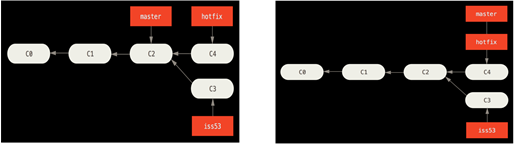
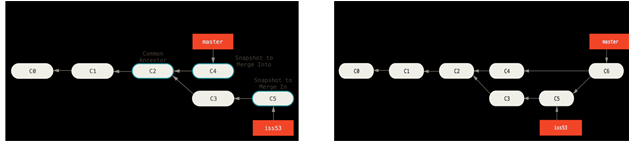

# Git Branch

**A branch in Git is simply a lightweight movable pointer to one of the commit objects.** It moves forward every time a new commit object is created. 

- The default branch is `master`. Nothing special about it except for being created by `git init`. 
- Multiple branches can be created to point to the same commit object. 
- There is also a special pointer **`HEAD` that points to current branch**. 


## Manage Branches{#branch-manage}

### View

Use `git branch`, without any branch name, to list all the branches.

- `git branch -v`: list branches and their last commit. 

- `git branch --merged`: list branches that are already merged to base branch. Branches in this list other than base branch are safe to delete. 

- `git branch --no-merged`: list branches that contains work not merged to base branch yet. You cannot delete them unless use force delete. 

- `git log --graph --pretty=oneline --abbrev-commit`: display commit path as trees.

  ```shell
  git config --global alias.tree "log --graph --pretty=format:'%Cred%h%Creset -%C(yellow)%d%Creset %s %Cgreen(%cr) %C(bold blue)<%an>%Creset%n' --abbrev-commit --date=relative --branches"
  ```

### Create

Use `git branch <branch name>` to create a new branch. 

It basically creates a new pointer pointing to current commit object. But it **does not move the`HEAD` pointer** so we are still on the original branch. 

### Delete

Use `git branch -d <branch name>` to delete a branch, that has been merged to base branch. 

### Switch

Use `git checkout <branch name>` to switch to a branch. 

Note two things happen after the command:

- `HEAD` pointer now points to the new branch.
- Files in working directory is changed based on snapshot of the new branch. 

Use `git checkout -b <new branch name>` to create a new branch then immediately switch to it. 

## Merge Branches {#branch-merge}

We have a base branch and a topic branch, and we want to merge the topic branch into the base branch so that **commits in topic branch becomes part of base branch commit history** as well. 

To merge topic branch into base branch, do:

```shell
# merge always followed by topic, then add base
$ git merge topic base
```

There are two types of merging. 

### Fast-forward

If base branch is the ancestor of the topic branch, Git will use fast forward to simply move base branch pointer to same position of topic branch. 



### Three-way

if base branch is not a direct ancestor of the topic branch, Git do a three-way merge. It applies changes in both branches with respect to **their common ancestor**, then creates a new commit object pointing to both branches, called **merge commit**. Base branch is then moved to this newly created commit object. 



### Conflicts

If **two branches make changes to the same file**, three-way merge raises a conflict. To resolve the conflict: 

- run `git status` to find out all **files with a merge conflict** in the `unmerged paths` section.  

- Git **adds conflict-resolution markers directly to the files**. 

  ```json
  <<<<<<< HEAD:index.html
  <div id="footer">contact : email.support@github.com</div>
  =======
  <div id="footer">
   please contact us at support@github.com
  </div>
  >>>>>>> iss53:index.html
  ```

- edit each file manually to remove conflict, and the dividers.

- run `git add` on each file to mark it as resolved. 

- run `git commit` to conclude the merge, after all files are resolved. 

## Rebase Branches {#branch-rebase}

We have a base branch and a topic branch bifurcate at some point, and we want to **remove the bifurcation to create a single path of commit history**.  It is often done to clean up history before push to remote repo. 

We do it with rebase since 3-way merging could not. Rebasing takes all changes in one branch from the common ancestor, the **entire commit path**, and applies it onto another branch by creating a **replacement path**. Note replacement path may include multiple commits. 


Do the following: 

```shell
# rebase is always followed by base, then add topic
$ git rebase master experiment
# note the order of merge in contrast to rebase
$ git merge experiment master
```

**Do NOT rebase commits that exist outside your repository**, i.e. remote repository checked out by others. 

### Squash Merge

When doing the rebase, entire commit path of topic branch is copied commit by commit onto base branch as replacement path. We want to **squash the path into a single commit** to make it more compact. 

Use `git merge --squash topic base` to take all the work on topic branch, squashes it into **a single replacement changeset**, and copy to base branch. 

- Note the **changeset is placed in staging area** and not committed yet. When next commit happens, a single commit on base branch including all the changes is created. 
- Note topic branch is **not really merged** into base. It needs force delete to remove. 

Use `git rebase -i base topic` to enter interactive rebasing mode, and to pick and select which commits of topic path to be squashed. 